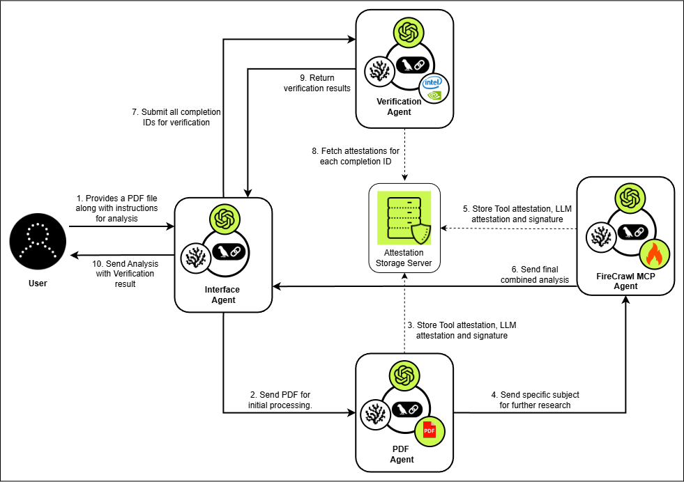

# Phala-Network-MAS 
Secure • Verifiable • Multi-Agent System 

---

## 📌 Problem Statement

Many organizations — especially in healthcare, finance, government, law, and research — hesitate to use AI systems for document analysis due to **data confidentiality concerns**.

The moment a sensitive PDF leaves their infrastructure and enters a cloud environment, they lose visibility into:

- Who can access the data?
- Whether the model provider can inspect it?
- Whether the cloud provider can inspect it?
- Whether the hardware provider can inspect it? 

Even if vendors claim security, organizations have **no verifiable proof** that the document remained confidential during processing.

### The Core Challenges

1. **How to use AI on sensitive PDFs without data exposure?**
2. **How to provide verifiable, user-facing proof that processing occurred in a secure environment?**

**Real-world example:**  
Phala’s confidential AI deployment for law firms:  
https://phala.com/posts/confidential-ai-for-law-firms  

---

# 🚀 Solution Overview

This system combines:

- Coral Protocol (multi-agent orchestration framework)
- Phala Network (confidential computing network)

to build a **confidential, verifiable, multi-agent AI workflow** for sensitive PDF processing.

Users can:

- Upload a PDF  
- Run secure analysis  
- Request deeper research  
- Receive a **final attestation verification report**

Every sensitive operation is executed inside a **Trusted Execution Environment (TEE)**, and cryptographic attestation quotes are generated and verified.

---

# 🏗 Architecture

- **Coral Protocol** → Handles multi-agent orchestration  
- **Phala Network** → Executes:
  - MCP Server  
  - API Server  
  - Agents  
  - LLMs  
  inside TEEs with attestation support  

---

# 🤖 System Architecture: 4-Agent Design

---

## 1️⃣ Coral Interface Agent

**Purpose:**  
Entry point for all user interaction and workflow orchestration.

### Responsibilities

- Accept user queries  
- Handle PDF uploads  
- Route tasks to downstream agents  
- Manage conversation flow  

**Tools:** None  
**LLM:** `gpt-oss-120b`

---

## 2️⃣ PDF Agent

**Purpose:**  
Secure PDF storage and basic analysis inside a TEE.

### Responsibilities

- Store PDFs encrypted inside enclave memory  
- Perform:
  - Store  
  - List  
  - Delete  
  - Decrypt (only inside enclave memory)  
- Basic document analysis  
- Metadata extraction  
- Generate attestation quotes proving TEE execution  

### Tools

- PDF API Server (deployed on Phala)  
  https://hub.docker.com/repository/docker/pranav6773/encrypted-pdf-api/general  

**LLM:** `gpt-oss-120b`

---

## 3️⃣ FireCrawl MCP Agent

**Purpose:**  
Advanced research and deep document analysis.

### Responsibilities

- Retrieve secure PDF content from PDF Agent  
- Perform:
  - Long-form research  
  - Topic exploration  
  - Intensive contextual analysis  
- Generate attestation quote for secure execution  

### Tools

- FireCrawl MCP Server (self-hosted on Phala)  
  https://docs.firecrawl.dev/contributing/self-host  

**LLM:** `gpt-oss-120b`

---

## 4️⃣ Attestation Verification Agent

**Purpose:**  
Validate integrity and trust of the entire workflow.

### Responsibilities

- Collect attestation quotes from:
  - PDF Agent  
  - FireCrawl MCP Agent  
- Verify:
  - Enclave measurements  
  - CPU vendor signatures  
  - GPU vendor signatures  
  - Code + environment integrity  
- Produce final human-readable verification result  

### Verification Tools

- Intel TDX Verification  
  https://phalanetwork-1606097b.mintlify.app/phala-cloud/confidential-ai/verify/verify-attestation#verify-intel-tdx-cpu-attestation  

- NVIDIA GPU Attestation Verification  
  https://phalanetwork-1606097b.mintlify.app/phala-cloud/confidential-ai/verify/verify-attestation#verify-nvidia-gpu-attestation  

**LLM:** `gpt-oss-120b`

---

# 🔐 Security Model

All sensitive operations occur inside a **Trusted Execution Environment (TEE)** on Phala Network.

The system produces:

- Cryptographic attestation quotes  
- Hardware-backed verification  
- Proof of correct code execution  
- Vendor signature validation  

The final output includes a **user-readable attestation verification summary**.

---

# ✅ Key Benefits

### 🔒 Confidentiality

The PDF remains inside a TEE for its entire lifecycle:

`Storage → Analysis → Research → Verification`

### 🧾 Verifiable Trust

Users receive cryptographic proof that:

- The environment was trusted  
- The hardware was genuine  
- The code was measured and approved  

### 🏛 Audit-Ready

Organizations can archive attestation quotes for:

- Compliance  
- Internal audit  
- Regulatory review  

### 📜 Future Regulatory Alignment

Governments may require organizations to prove that:

- Approved AI models were used  
- Secure execution environments were enforced  

A verifiable attestation pipeline like this positions organizations for future regulatory standards.

---